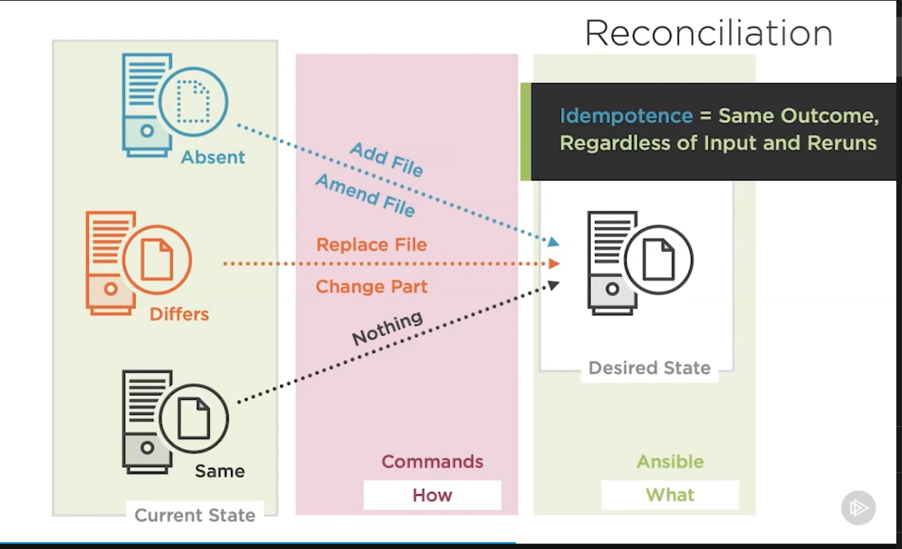

Ansible Practice 

Ansible is a tool used to create the same output in all endpoints regardless of inputs and reruns (Idempotent)

--------------------------------
Ad-Hoc

-> Ansible ad-hoc commands uses the /usr/bin/ansible command line tool to automate a single task on one or more managed nodes.

Advantages
* Quick and easy

Disadvantages
* They are not re-usable

eg:

ansible -m homebrew -a "name=bat state=latest" localhost

breakdown:

ansible -> ad-hoc ansible command
-m -> module name 
-a -> arguments

-------------------------------------

Playbooks 

